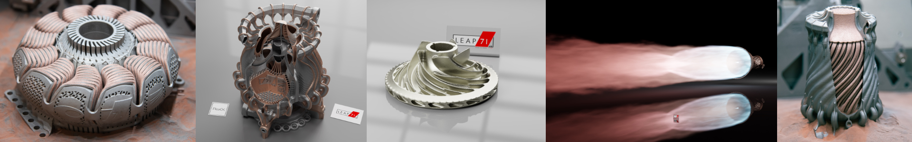
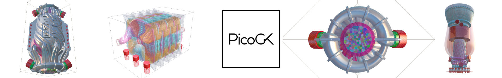
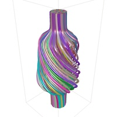
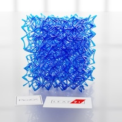
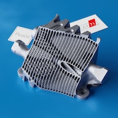
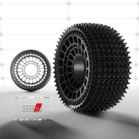
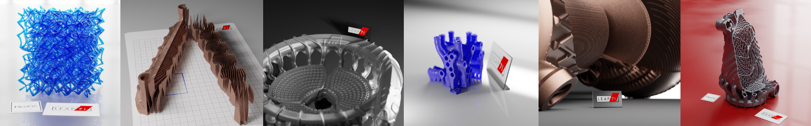

# Welcome to the LEAP 71 Github

At [LEAP 71](https://leap71.com) we build complex technical objects using [Computational Engineering Models (CEM)](https://leap71.com/computationalengineering/). These models output parts, structures, and entire functional assemblies of machines, ready for production using advanced digital production technologies, such as industrial 3D Printing.

We use our technology to build anything from [rocket engines](https://leap71.com/rp/) to energy efficient heat exchangers and electric motors. 

[Check out our gallery here.](https://leap71.com/gallery/)

We are committed to supporting a growing open-source community around Computational Engineering, and are in the process of releasing many of our foundational technologies and computational models to the public.

## PicoGK

At the core of our work lies **[PicoGK](https://github.com/leap71/PicoGK)** ("peacock"), a compact and robust geometry kernel. We have released PicoGK under the permissive [Free and Open Source (FOSS) Apache 2.0 license](https://www.apache.org/licenses/LICENSE-2.0).

**[To get started with PicoGK, check out the documentation.](https://github.com/leap71/PicoGK/tree/main/Documentation)**

Computational Engineering benefits greatly from the free exchange of knowledge and algorithms. While much of LEAP 71's work is proprietary, we are constantly publishing foundational modules and examples as open-source. 

At this time, the following repositories are available:

#### **Base Libraries** 

Use these libraries as submodules in your own Computational Engineering projects.

|                                                        | Repository                                                   |                                                              |
| ------------------------------------------------------ | ------------------------------------------------------------ | ------------------------------------------------------------ |
|                   | [**PicoGK**](https://github.com/leap71/PicoGK)               | The C#-based geometry foundation for all of our work at [LEAP 71](https://leap71.com) |
|        | [**ShapeKernel**](https://github.com/leap71/LEAP71_ShapeKernel) | A generalized framework for creating computational geometry, based on PicoGK. |
|  | [**LatticeLibrary**](https://github.com/leap71/LEAP71_LatticeLibrary) | An advanced library for creating complex lattice structures, based on ShapeKernel and PicoGK. |
|       | **[QuasiCrystals](https://github.com/leap71/LEAP71_QuasiCrystals)** | A library to genrated aperiodic tilings, such as [Penrose Patterns](https://en.wikipedia.org/wiki/Penrose_tiling) (in 2D) and [quasi-crystalline structures](https://en.wikipedia.org/wiki/Quasicrystal) (in 3D). |

#### **Example Projects** 

Check out these example projects to see how to build objects in PicoGK.

|                                                | Repository                                                   |                                                              |
| ---------------------------------------------- | ------------------------------------------------------------ | ------------------------------------------------------------ |
|  | [**Helix Heat Exchanger**](https://github.com/leap71/LEAP71_HelixHeatX) | An example how to build a heat exchanger using ShapeKernel and PicoGK |
|  | **[Rover Wheel](https://github.com/leap71/LEAP71_RoverWheel)** | An example how to build rover-wheel-like objects using ShapeKernel and PicoGK |

#### Under the hood

If you want to compile your own version of the PicoGK runtime and build custom installers, here's the source code. 

You are usually not interested in these repositories as an end user of PicoGK.

| Repository                                                   |                                                |
| ------------------------------------------------------------ | ---------------------------------------------- |
| [**PicoGKRuntime**](https://github.com/leap71/PicoGKRuntime) | C++ source code for the PicoGK runtime module. |
| [**PicoGKInstaller**](https://github.com/leap71/PicoGKInstaller) | Source code for the PicoGK installers          |

> [!TIP]
>
> If you are looking for the PicoGK installers, [download them here](https://github.com/leap71/PicoGK/releases/).

## More information

To understand the motivation behind PicoGK, check out this series of articles on the authors' personal website.

- [Fundamentals of Computational Engineering — **Prologue**](https://jlk.ae/2023/10/04/computationalengineering-prologue/)

- [Fundamentals of Computational Engineering — **Part 1: A bit of history**](https://jlk.ae/2023/10/06/computational-engineering-part-1-history/)

- [Fundamentals of Computational Engineering — **Part 2: The technology**](https://jlk.ae/2023/10/09/computational-engineering-part-2-the-technology/)

- [Fundamentals of Computational Engineering — **Part 3: Voxels to the rescue**](https://jlk.ae/2023/10/11/computational-engineering-part-3-voxels/)

- [Fundamentals of Computational Engineering — **Part 4: Implicits**](https://jlk.ae/2023/10/13/fundamentals-of-computational-engineering-part-4-implicits/)

- [Fundamentals of Computational Engineering — **Part 5: All you need is a few functions**](https://jlk.ae/2023/10/16/fundamentals-of-computational-engineering-part-5-all-you-need-is-a-few-functions/)

- [LEAP 71 Shape Kernel — **Tutorial 1: Getting started with the ShapeKernel**](https://github.com/leap71/LEAP71_ShapeKernel/blob/main/Documentation/README-GettingStarted.md)

- [LEAP 71 Shape Kernel — **Tutorial 2: Designing a computational heat exchanger**](https://github.com/leap71/LEAP71_HelixHeatX)

For more examples of what you can do with PicoGK, [check out our Instagram.](https://www.instagram.com/leap.71/) [follow us on X](https://twitter.com/leap_71), and [visit the LEAP 71 website.](https://leap71.com/)  

Image credits LEAP 71 / Fraunhofer IGCV (for multi material metal prints)
